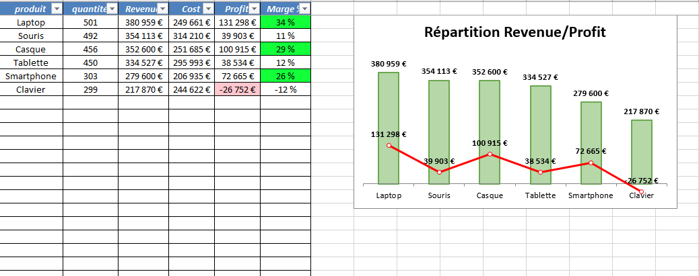
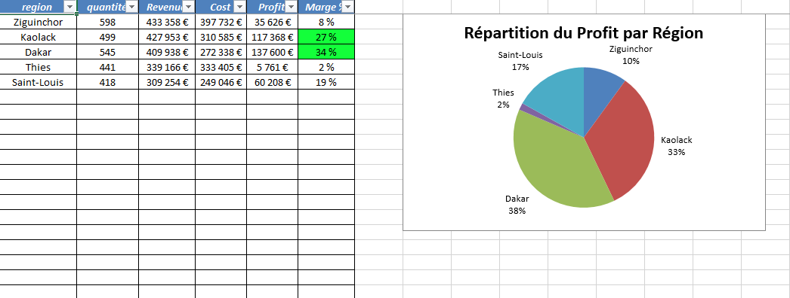
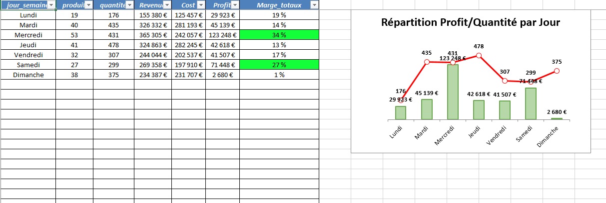

# 📊 Pipeline ETL — Analyse des Ventes Janvier 2026

Pipeline **ETL (Extract, Transform, Load)** robuste et modulaire pour l'analyse des ventes mensuelles. Il transforme des données brutes de ventes (produits, régions, heures d'achat) en rapports Excel décisionnels automatisés avec graphiques et mise en forme conditionnelle.

**Fonctionnalité clé** : Extraction depuis **PostgreSQL** (via `psycopg2`) avec mécanisme de retry exponentiel, nettoyage avancé, feature engineering, 3 axes d'analyse métier et génération automatisée de tableaux de bord Excel professionnels.

---

## 🌟 Points Forts

| Fonctionnalité | Description |
|---|---|
| **Connectivité PostgreSQL** | Extraction robuste avec `psycopg2` et retry exponentiel (3 tentatives, délai x2) |
| **Sécurité** | Credentials PostgreSQL externalisés via `python-dotenv` — aucun secret dans le code |
| **Architecture Modulaire** | Séparation stricte : extraction → nettoyage → features → analyses → reporting |
| **Nettoyage Robuste** | `pd.to_numeric(errors='coerce')` sur toutes les conversions — zéro plantage sur valeurs invalides |
| **Gestion Temporelle** | Conversion des secondes en heures d'achat lisibles via `pd.to_timedelta` |
| **Feature Engineering** | Jour de la semaine (FR), Revenue, Cost, Profit, Marge calculés automatiquement |
| **3 Axes d'Analyse Métier** | Par produit, par région, par jour de la semaine |
| **Reporting Excel Avancé** | 5 onglets, graphiques combinés (colonne + ligne sur axe secondaire), mise en forme conditionnelle pilotée par `config.py` |
| **Logging Professionnel** | Loguru avec rotation 10 MB, rétention 30 jours, compression ZIP, horodatage |
| **Configuration Centralisée** | Chemins, couleurs, seuils, paramètres DB tous gérés dans `config.py` |
| **Tests Unitaires** | Couverture pytest sur `clean_data.py` et `features.py` |

---

## 🛠️ Architecture du Projet

```
Structuration-Projet-ventes_janvier/
├── images/
│   ├── Rapport_Excel/              # 📸 Captures d'écran du rapport généré
│   └── Diagramme_Architecture/     # 🏗️ Diagramme d'architecture
├── src/
│   ├── analysis/
│   │   ├── __init__.py
│   │   ├── analysis_produit.py     # 📊 Analyse par produit
│   │   ├── analysis_region.py      # 📊 Analyse par région
│   │   └── analysis_jours.py       # 📊 Analyse par jour de la semaine
│   ├── __init__.py
│   ├── extract.py                  # 📥 Extraction PostgreSQL (retry exponentiel)
│   ├── clean_data.py               # 🧹 Nettoyage et normalisation
│   ├── features.py                 # ✨ Feature engineering
│   ├── rapport_excel.py            # 📊 Moteur de rendu XlsxWriter
│   └── logger.py                   # 📝 Configuration Loguru
├── tests/
│   ├── __init__.py
│   ├── test_clean_data.py          # ✅ Tests unitaires nettoyage
│   └── test_features.py            # ✅ Tests unitaires features
├── data/
│   ├── raw/                        # 💾 Données sources (ignorées par Git)
│   └── processed/                  # 🔄 Données nettoyées (ignorées par Git)
├── log/                            # 📜 Logs horodatés (ignorés par Git)
├── rapport_excel/                  # 📂 Rapports générés (ignorés par Git)
├── .env                            # 🔐 Credentials PostgreSQL (ignoré par Git)
├── .env.example                    # 📋 Template de configuration
├── config.py                       # ⚙️ Configuration centralisée
├── main.py                         # 🚀 Point d'entrée du pipeline
├── requirements.txt                # 📦 Dépendances
└── README.md                       # 📖 Documentation
```

---

## ⚙️ Configuration (`config.py` + `.env`)

Toute la configuration est centralisée dans `config.py`. Les credentials PostgreSQL sont externalisés dans un fichier `.env` non versionné.

**`.env.example`** (à copier en `.env` et remplir) :
```
DB_HOST=localhost
DB_PORT=5432
DB_NAME=db_ventes_janvier
DB_USER=votre_user
DB_PASSWORD=votre_mot_de_passe
DB_TABLE=ventes_janvier
```

**`config.py`** :
```python
from dotenv import dotenv_values

env = dotenv_values(".env")

DB_CONFIG = {
    'host': env['DB_HOST'],
    'port': int(env['DB_PORT']),
    'dbname': env['DB_NAME'],
    'user': env['DB_USER'],
    'password': env['DB_PASSWORD']
}
```

---

## 📊 Pipeline ETL — Flux de Données

```
[ PostgreSQL ]
        │
        ▼
[ Extraction ]
extract.py (retry + psycopg2)
        │
        ▼
[ Data Cleaning ]
clean_data.py (format, types, valeurs invalides, heures d'achat)
        │
        ▼
[ Feature Engineering ]
features.py (jour_semaine FR, Revenue, Cost, Profit, Marge)
        │
        ▼
[ Business Analysis ]
analysis/ (Produit, Région, Jour)
        │
        ▼
[ Reporting Layer ]
rapport_excel.py (Excel automatisé + graphiques)
        │
        ▼
[ Decision Support ]
Rapport exploitable par la direction
```

---

## 📈 Rapport Excel Automatisé

| Onglet | Contenu | Visualisation |
|---|---|---|
| Données Brutes | Données extraites de PostgreSQL | — |
| Données Nettoyées | Données après nettoyage + features | Mise en forme conditionnelle (Profit, Marge) |
| Données Par Produit | Agrégations par produit | Graphique combiné colonne (Revenue) + ligne (Profit) sur axe secondaire |
| Données Par Région | Agrégations par région | Graphique camembert — répartition du Profit par région |
| Données Par Jour | Performances par jour de la semaine | Graphique combiné colonne (Profit) + ligne (Quantité) sur axe secondaire |


## 1. Produit — Clavier en perte

Le Clavier est le seul produit déficitaire avec une marge négative de -12% et un profit de -26 752€ — son coût unitaire dépasse son prix de vente, signalant une anomalie tarifaire à corriger en priorité.

## 2. Produit — Laptop leader

Le Laptop génère le profit le plus élevé (131 298€, marge 34%) malgré un volume de ventes comparable aux autres produits — c'est le produit à forte valeur ajoutée du catalogue.

## 3. Région — Thiès sous-performante

Thiès affiche la marge la plus faible (2%) avec seulement 5 761€ de profit malgré 441 ventes — un ratio coût/revenue défavorable qui mérite une révision de la stratégie commerciale locale.

## 4. Jour — Dimanche creux commercial

Le Dimanche enregistre la marge la plus basse (1%) avec seulement 2 680€ de profit malgré 375 ventes — volume correct mais rentabilité quasi nulle, suggérant des remises excessives en fin de semaine.


---

## 📸 Aperçu du Rapport






---

## 🏗️ Diagramme d'Architecture


---

## ✅ Tests Unitaires

```bash
pytest tests/ -v
```

```
tests/test_clean_data.py::test_cleanning_data    PASSED
tests/test_features.py::test_add_feature         PASSED

2 passed
```

Les tests vérifient : normalisation texte, conversion numériques, conversion heures d'achat, feature engineering (jour semaine, Revenue, Cost, Profit, Marge).

---

## 🔧 Dépendances

| Bibliothèque | Version | Utilité |
|---|---|---|
| `psycopg2-binary` | 2.9.12 | Connexion PostgreSQL |
| `pandas` | 3.0.2 | Manipulation et nettoyage des données |
| `loguru` | 0.7.3 | Logging structuré avec rotation |
| `xlsxwriter` | 3.2.9 | Génération de rapports Excel avancés |
| `python-dotenv` | 1.2.2 | Gestion sécurisée des credentials |
| `pytest` | 9.0.3 | Tests unitaires |

---

## 🚀 Installation & Lancement

```bash
# 1. Cloner le dépôt
git clone https://github.com/SopeTaha92/Structuration-Projet-ventes_janvier.git
cd Structuration-Projet-ventes_janvier

# 2. Créer l'environnement virtuel
python -m venv venv
venv\Scripts\activate        # Windows
# source venv/bin/activate   # Linux/Mac

# 3. Installer les dépendances
pip install -r requirements.txt

# 4. Configurer les credentials PostgreSQL
cp .env.example .env
# Éditer .env avec vos paramètres de connexion

# 5. Lancer le pipeline
python main.py

# 6. Lancer les tests
pytest tests/ -v
```

---

## 📅 Prochaines Étapes

- [ ] Dashboard interactif avec **Streamlit** ou **Power BI**
- [ ] Étendre l'analyse sur l'année complète (12 mois)
- [ ] Optimisation SQL : index sur `date` et `produit`
- [ ] Tests d'intégration sur le pipeline complet

---

## 🔗 Autres Projets

[**HR Analytics Pipeline**](https://github.com/SopeTaha92/hr-analytics-pipeline) — Pipeline ETL RH complet avec 5 axes d'analyse et tests unitaires

[**Pipeline E-commerce**](https://github.com/SopeTaha92/Projet_vente_e-commerce) — Pipeline ETL ventes avec double connectivité PostgreSQL (`psycopg2` + `pg8000`)

---

## 📝 Licence

Ce projet est open source et disponible sous la licence **MIT**.

---

## 👨‍💻 Auteur

**Mahmoud At-Tidiane** — Passionné par l'ingénierie des données, l'analyse décisionnelle et l'intégration PostgreSQL.

- GitHub : [@SopeTaha92](https://github.com/SopeTaha92)
- Projet : [Structuration-Projet-ventes_janvier](https://github.com/SopeTaha92/Structuration-Projet-ventes_janvier)
