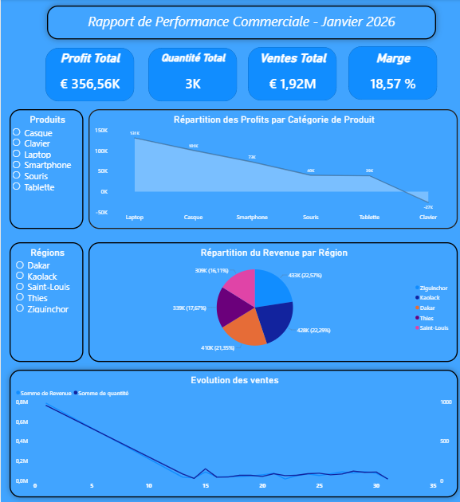
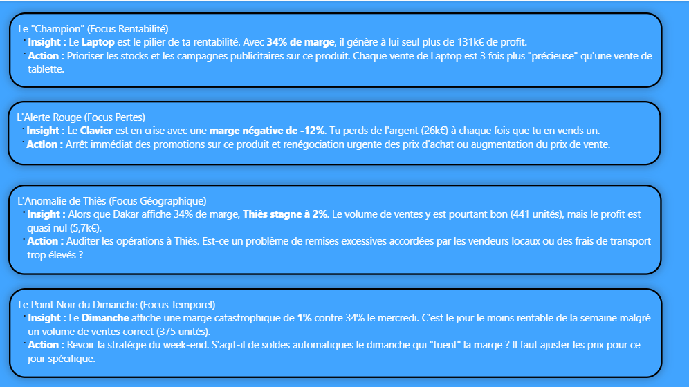

# 📊 End-to-End Sales Analytics Pipeline
### PostgreSQL → Python → Excel → Power BI Dashboard

---

## 🎯 Objectif Métier

Ce projet vise à analyser les performances commerciales mensuelles afin de :

- Identifier les produits les plus rentables
- Détecter les régions sous-performantes
- Analyser les variations de performance selon les jours de la semaine

👉 Objectif final : **aider à la prise de décision commerciale basée sur la donnée**

---

## 🚀 Overview

Pipeline **ETL (Extract, Transform, Load)** robuste et modulaire transformant des données brutes stockées dans **PostgreSQL** en rapports Excel automatisés et en dashboard Power BI décisionnel — avec graphiques combinés, mise en forme conditionnelle et insights métier actionnables.

---

## 🌟 Points Forts

| Fonctionnalité | Description |
|---|---|
| **Connectivité PostgreSQL** | Extraction robuste avec `psycopg2` et retry exponentiel (3 tentatives, délai x2) |
| **Filtrage temporel** | Extraction filtrée par période via `BETWEEN` — configurable dans `config.py` |
| **Sécurité** | Credentials PostgreSQL externalisés via `python-dotenv` — aucun secret dans le code |
| **Architecture Modulaire** | Séparation stricte : extraction → nettoyage → features → analyses → reporting |
| **Nettoyage Robuste** | `pd.to_numeric(errors='coerce')` sur toutes les conversions — zéro plantage sur valeurs invalides |
| **Gestion Temporelle** | Conversion des secondes en heures d'achat lisibles via `pd.to_timedelta` |
| **Feature Engineering** | Jour de la semaine (FR), Revenue, Cost, Profit, Marge calculés automatiquement |
| **Reporting Excel Avancé** | 5 onglets, graphiques combinés, mise en forme conditionnelle pilotée par `config.py` |
| **Dashboard Power BI** | 2 pages — Dashboard KPIs + Business Insights narratifs et actionnables |
| **Automatisation locale** | Exécution automatique quotidienne via `.bat` + Planificateur de tâches Windows |
| **Logging Professionnel** | Loguru avec rotation 10 MB, rétention 30 jours, compression ZIP, horodatage |
| **Configuration Centralisée** | Chemins, couleurs, seuils, dates, paramètres DB tous gérés dans `config.py` |
| **Tests Unitaires** | Couverture pytest sur `clean_data.py` et `features.py` |

---

## 🛠️ Architecture du Projet

```
Structuration-Projet-ventes_janvier/
├── images/
│   ├── Rapport_Excel/              # 📸 Captures d'écran du rapport Excel
│   ├── Dashbord_Power_BI/          # 📸 Captures d'écran du dashboard
│   └── Diagramme_Architecture/     # 🏗️ Diagramme d'architecture
├── power_bi/
│   ├── data/                       # 📊 Données Excel alimentant le dashboard (ignorées par Git)
│   └── dashboard/                  # 📈 Fichier Power BI (.pbix)
│       └── dashboard_ventes_janvier.pbix
├── reports/
│   └── rapport_analyse_janvier_2026.md  # 📄 Rapport d'analyse complet
├── src/
│   ├── analysis/
│   │   ├── __init__.py
│   │   ├── analysis_produit.py     # 📊 Analyse par produit
│   │   ├── analysis_region.py      # 📊 Analyse par région
│   │   └── analysis_jours.py       # 📊 Analyse par jour de la semaine
│   ├── __init__.py
│   ├── extract.py                  # 📥 Extraction PostgreSQL (retry exponentiel)
│   ├── clean_data.py               # 🧹 Nettoyage et normalisation
│   ├── features.py                 # ✨ Feature engineering
│   ├── rapport_excel.py            # 📊 Moteur de rendu XlsxWriter
│   └── logger.py                   # 📝 Configuration Loguru
├── tests/
│   ├── __init__.py
│   ├── test_clean_data.py          # ✅ Tests unitaires nettoyage
│   └── test_features.py            # ✅ Tests unitaires features
├── data/
│   ├── raw/                        # 💾 Données sources (ignorées par Git)
│   └── processed/                  # 🔄 Données nettoyées (ignorées par Git)
├── log/                            # 📜 Logs horodatés (ignorés par Git)
├── rapport_excel/                  # 📂 Rapports Excel générés (ignorés par Git)
├── .env                            # 🔐 Credentials PostgreSQL (ignoré par Git)
├── .env.example                    # 📋 Template de configuration
├── lancer_pipeline.bat             # ⚙️ Script d'automatisation local (ignoré par Git)
├── lancer_pipeline.bat.example     # 📋 Template du script d'automatisation
├── config.py                       # ⚙️ Configuration centralisée
├── main.py                         # 🚀 Point d'entrée du pipeline
├── requirements.txt                # 📦 Dépendances
└── README.md                       # 📖 Documentation
```

---

## ⚙️ Pipeline ETL — Flux de Données

```
[ PostgreSQL ]
        │
        ▼
[ Extraction ]
extract.py → retry exponentiel + psycopg2 + filtre BETWEEN dates
        │
        ▼
[ Data Cleaning ]
clean_data.py → types, valeurs invalides, heures d'achat
        │
        ▼
[ Feature Engineering ]
features.py → jour_semaine (FR), Revenue, Cost, Profit, Marge
        │
        ├──────────────────────────────────┐
        ▼                                  ▼
[ Business Analysis ]            [ Power BI Data Export ]
analysis/ → Produit, Région, Jour   power_bi/data/
        │
        ▼
[ Reporting Layer ]
rapport_excel.py → Excel automatisé + graphiques
        │
        ▼
[ Decision Support ]
Rapport Excel + Dashboard Power BI exploitables par la direction
        │
        ▼
[ Automatisation ]
Planificateur Windows → exécution quotidienne à 9H
```

---

## ⚙️ Configuration (`config.py` + `.env`)

Toute la configuration est centralisée dans `config.py`. Les credentials PostgreSQL sont externalisés dans un fichier `.env` non versionné.

**`.env.example`** (à copier en `.env` et remplir) :
```
DB_HOST=localhost
DB_PORT=5432
DB_NAME=db_ventes_janvier
DB_USER=votre_user
DB_PASSWORD=votre_mot_de_passe
DB_TABLE=votre_table
```

**`config.py`** :
```python
from dotenv import dotenv_values

env = dotenv_values(".env")

DB_CONFIG = {
    'host': env['DB_HOST'],
    'port': int(env['DB_PORT']),
    'dbname': env['DB_NAME'],
    'user': env['DB_USER'],
    'password': env['DB_PASSWORD']
}

# Période d'analyse — modifiable sans toucher au code
DATE_DEBUT = '2026-01-01'
DATE_FIN = '2026-01-31'
```

---

## 📈 Rapport Excel Automatisé

| Onglet | Contenu | Visualisation |
|---|---|---|
| Données Brutes | Données extraites de PostgreSQL | — |
| Données Nettoyées | Données après nettoyage + features | Mise en forme conditionnelle (Profit, Marge) |
| Données Par Produit | Agrégations par produit | Graphique combiné colonne + ligne |
| Données Par Région | Agrégations par région | Graphique camembert (répartition profit) |
| Données Par Jour | Performances par jour de la semaine | Graphique combiné colonne + ligne (Profit/Quantité) |

---

## 📊 Dashboard Power BI

Le dashboard Power BI se compose de **2 pages** alimentées automatiquement par le pipeline :

**Page 1 — Dashboard KPIs**
- 4 KPIs globaux : Profit Total, Quantité, Revenue, Marge
- Répartition des profits par produit (graphique en cascade)
- Répartition du revenue par région (camembert)
- Évolution des ventes dans le temps

**Page 2 — Business Insights**
- 4 insights narratifs structurés avec recommandations actionnables
- Format : Contexte → Insight → Action recommandée

---

## 🤖 Automatisation Locale

Le pipeline s'exécute automatiquement via le **Planificateur de tâches Windows** :

- ⏰ Exécution quotidienne à **9H00**
- 🔄 Exécution au démarrage si un lancement planifié a été manqué
- 🔁 **3 tentatives** automatiques en cas d'échec (intervalle de 5 minutes)

```batch
# lancer_pipeline.bat.example
@echo off
cd /d "%~dp0"
call venv\Scripts\activate
python main.py
exit
```

---

## 📊 Key Insights

### 🔻 Produit déficitaire
Le **Clavier** affiche une marge négative de **-12%** avec **-26 752€** de profit — son coût unitaire dépasse son prix de vente, signalant une anomalie tarifaire à corriger en priorité.

### 🔺 Produit le plus rentable
Le **Laptop** génère le profit le plus élevé (**131 298€**, marge **34%**) malgré un volume comparable aux autres produits — c'est le produit à forte valeur ajoutée du catalogue.

### 📍 Région sous-performante
**Thiès** affiche la marge la plus faible (**2%**) avec seulement **5 761€** de profit malgré **441 ventes** — un ratio coût/revenue défavorable qui mérite une révision de la stratégie commerciale locale.

### 📅 Jour peu rentable
Le **Dimanche** enregistre une rentabilité quasi nulle (**1%**, **2 680€** de profit) malgré **375 ventes** — possible sur-discount ou faible conversion en fin de semaine.

> 📄 Rapport d'analyse complet disponible dans [`reports/rapport_analyse_janvier_2026.md`](reports/rapport_analyse_janvier_2026.md)

---

## 📸 Aperçu du Rapport Excel


---

## 📸 Aperçu du Dashboard Power BI




---

## 🏗️ Diagramme d'Architecture


---

## 🧪 Tests Unitaires

```bash
pytest tests/ -v
```

```
tests/test_clean_data.py::test_cleanning_data    PASSED
tests/test_features.py::test_add_feature         PASSED

2 passed
```

Les tests vérifient : normalisation texte, conversion numériques, conversion heures d'achat, feature engineering (jour semaine, Revenue, Cost, Profit, Marge).

---

## 🔧 Dépendances

| Bibliothèque | Version | Utilité |
|---|---|---|
| `psycopg2-binary` | 2.9.12 | Connexion PostgreSQL |
| `pandas` | 3.0.2 | Manipulation et nettoyage des données |
| `loguru` | 0.7.3 | Logging structuré avec rotation |
| `xlsxwriter` | 3.2.9 | Génération de rapports Excel avancés |
| `python-dotenv` | 1.2.2 | Gestion sécurisée des credentials |
| `pytest` | 9.0.3 | Tests unitaires |

---

## 🚀 Installation & Lancement

```bash
# 1. Cloner le dépôt
git clone https://github.com/SopeTaha92/Structuration-Projet-ventes_janvier.git
cd Structuration-Projet-ventes_janvier

# 2. Créer l'environnement virtuel
python -m venv venv
venv\Scripts\activate        # Windows
# source venv/bin/activate   # Linux/Mac

# 3. Installer les dépendances
pip install -r requirements.txt

# 4. Configurer les credentials PostgreSQL
cp .env.example .env
# Éditer .env avec vos paramètres de connexion

# 5. Configurer le script d'automatisation
cp lancer_pipeline.bat.example lancer_pipeline.bat

# 6. Lancer le pipeline manuellement
python main.py

# 7. Ouvrir le dashboard Power BI
# Ouvrir power_bi/dashboard/dashboard_ventes_janvier.pbix
# Cliquer sur "Actualiser" pour charger les dernières données

# 8. Lancer les tests
pytest tests/ -v
```

---

## ⚠️ Limitations

- Données limitées à janvier 2026 — pas encore multi-mois
- Dashboard Power BI à actualiser manuellement après chaque exécution du pipeline
- Automatisation locale uniquement — pas encore déployée sur serveur

---

## 📅 Prochaines Étapes

- [ ] Étendre l'analyse sur l'année complète (12 mois)
- [ ] Déploiement serveur avec **Airflow**
- [ ] Optimisation SQL : index sur `date` et `produit`
- [ ] Script `db/init_db.py` pour initialisation automatique de la base
- [ ] Tests d'intégration sur le pipeline complet

---

## 🔗 Autres Projets

[**HR Analytics Pipeline**](https://github.com/SopeTaha92/hr-analytics-pipeline) — Pipeline ETL RH complet avec 5 axes d'analyse et tests unitaires

[**Pipeline E-commerce**](https://github.com/SopeTaha92/Projet_vente_e-commerce) — Pipeline ETL ventes avec double connectivité PostgreSQL (`psycopg2` + `pg8000`)

---

## 📝 Licence

Ce projet est open source et disponible sous la licence **MIT**.

---

## 👨‍💻 Auteur

**Mahmoud At-Tidiane** — Data Analyst | Python | PostgreSQL | Power BI

- GitHub : [@SopeTaha92](https://github.com/SopeTaha92)
- Projet : [Structuration-Projet-ventes_janvier](https://github.com/SopeTaha92/Structuration-Projet-ventes_janvier)
